# UDACITY -- Self-Driving Car Engineer [NanoDegree] --
# Part-1--Project-03 - **Behavioral Cloning**

# PROJECT WRITE-UP

---

## GOALS OF THE PROJECT
The Goals/Steps of this Project are the following:
1. Training Data Collection:  
   Use the UDACITY Car Driving Simulator to Collect Data of Good Driving Behavior.
2. Driver Behavior Cloning Model:  
   Build a Convolutional Neural Network (CNN) in Keras that Predicts Steering Angles based on Images from Cameras looking onto the Road.
3. Model Training & Validation:  
   Train & Validate the Model with a Training Set and a Validation Set from the collected Data.
4. Test the Model --> Self-Driving of Car!!! :-)  
   Test that the Model successfully Drives around the Track-1 in UDACITY Car Driving Simulator WithOUT Leaving the Road.
5. Project Writeup:  
   Summarize the Results with a written Project Report [THIS DOCUMENT! :-)].
6. Optional Extra Step:  
   Try to make the Car stay on the Road in Track-2 in UDACITY Car Driving Simulator, which is a more Difficult Track!!

## UDACITY Car Driving Simulator
### Download Link
The UDACITY Car Driving Simulator is available at the following Link:
1. For [**MICROSOFT Windows**](https://d17h27t6h515a5.cloudfront.net/topher/2017/February/58ae4419_windows-sim/windows-sim.zip)
2. For [**LINUX**](https://d17h27t6h515a5.cloudfront.net/topher/2017/February/58ae46bb_linux-sim/linux-sim.zip)
3. For [**MacOS**](https://d17h27t6h515a5.cloudfront.net/topher/2017/February/58ae4594_mac-sim.app/mac-sim.app.zip)

### Screenshots
Some Screenshots showing the **Features & Look-and-Feel of the Simulator:**

#### **Home Screen** showing Buttons for **Drive Modes** [Training Mode, Autonomous Mode] and **Tracks** [Track-1, Track-2]**:**
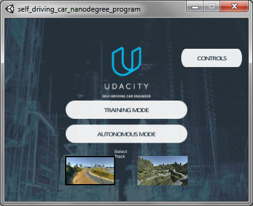

#### **Track-1 -- Training Mode:**
This is where we Drive the Car and **Record Data Samples of Good Driving Behavior** which will be Cloned by the Model:

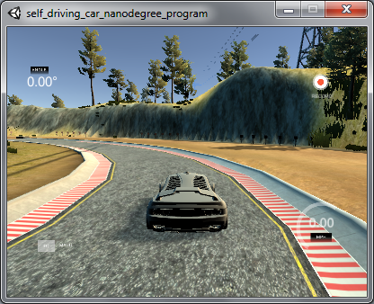

#### **Track-1 -- Autonomous Mode:**
This is where we use the Trained **Behavior Cloning Model** to **Autonomously Drive the Car**:

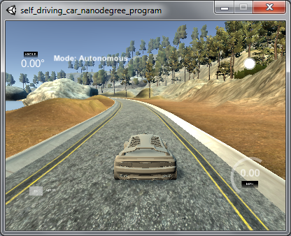

#### **Track-2:**
This is a more Challenging Track containing a Mountain/Jungle Road with a lot of sharp Curves and Ups & Downs, which can be attempted as an Optional Extra Step as per the Project!:

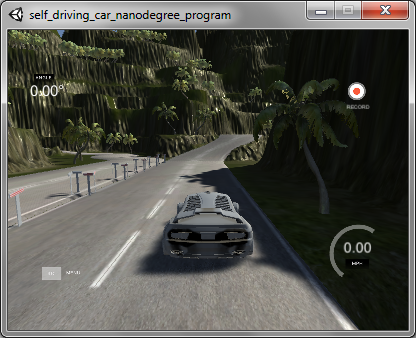

### Graphics Configuration that I Used
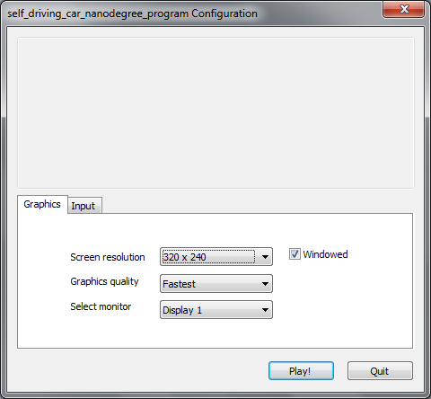

---

## PROJECT WRITE-UP / README
This Document is the PROJECT WRITE-UP / README.

## Project Rubric Points
In this Project Writeup, I will consider the [Project Rubric Points](https://review.udacity.com/#!/rubrics/432/view) individually and Describe how I addressed Each Point in my Implementation.

## 1. Project Code, Files:
Here are the Links To:
1. [**My Project @ GitHub**.](https://github.com/nmuthukumar/UDACITY_SDCarEngg-ND--P1--Prj03-BehavioralCloning)
2. [**The Project Code @ GitHub** - **'Model using Deep Learning (CNN)'** for 'Autonomously Driving a Car based on **Driver Behavior Cloning**'.](https://github.com/nmuthukumar/UDACITY_SDCarEngg-ND--P1--Prj03-BehavioralCloning/blob/master/model_beh-clone.py)

My **Project** mainly includes the following **Files**:
1. `model_beh-clone.py` - Containing the **Code** to Create and Train the **Behavior Cloning Model** using Convolutional Neural Network (**CNN**).  
   It contains Implementation of **2 Models**, and any one of them can be optionally chosen through a 'Feature Switch':  
   1. Model based on **LeNet-5**.
   2. Model based on **NVIDIA End-To-End Learning CNN for Self-Driving Cars** [*Default*].
2. **Trained Behavior Cloning Models**:  
   1. `Model_LeNet5_BehClone.h5` - Containing the Trained Behavior Cloning Model based on **LeNet-5**.
   2. `Model_NVIDIA_BehClone.h5` - Containing the Trained Behavior Cloning Model based on **NVIDIA End-To-End Learning CNN for Self-Driving Cars**.
3. `drive.py` - Script for Driving the Car in Autonomous Mode in the UDACITY Car Driving Simulator using the Trained Behavior Cloning Model.
4. `Project_Writeup.md` - Project Report summarizing the Results [THIS FILE! :-)].
5. **Project Output's Video Recording** showing successful **Autonomous Drive of Car in UDACITY Car Driving Simulator**:
   1. `Model_LeNet5_BehClone_Run-30FPS.mp4` - **Video of Autonomous Drive of Car** using **LeNet-5**.
   2. `Model_NVIDIA_BehClone_Run-30FPS.mp4` - **Video of Autonomous Drive of Car** using **NVIDIA End-To-End Learning CNN for Self-Driving Cars**.


## 2. Quality of Code:
### 2.1 Functional Code
- RUBRIC: The Model provided can be used to Successfully Operate the Simulation.

In the UDACITY provided Car Driving Simulator, using my `drive.py` File and my Trained Behavior Cloning Model File  
`Model_NVIDIA_BehClone.h5` (Model based on **NVIDIA End-To-End Learning CNN Architecture**)  
_OR_  
`Model_LeNet5_BehClone.h5` (Model based on **LeNet-5**),  
the Car can be Autonomously Driven around the Track by Executing respectively at the Command Prompt:
```sh
python drive.py Model_NVIDIA_BehClone.h5
```
_OR_
```sh
python drive.py Model_LeNet5_BehClone.h5
```

### 2.2 Usability & Readability of the Code
- RUBRIC: The Code in `model.py` uses a Python Generator, if needed, to Generate Data On-The-Fly for Training rather than Storing the Training Data in Memory. The `model.py` Code is clearly Organized and Comments are included where needed.

The File `model_beh-clone.py` contains the **Code** to Create, Train, Validate & Save the **Behavior Cloning Model** using Convolutional Neural Network (**CNN**).

The File `model_beh-clone.py` primarily consists of the following **Code Sections**:
1. Code to **Read & Load the Training Data**:  
   **Images of the Road** while Driving, from **Cameras** [Center, Left, Right] mounted in the Car looking onto the Road and the corresponding **Steering Angles**, using a **Python Generator** Function to Read and Generate Batches of Data On-The-Fly for Training rather than Storing All of the Training Data in Memory, in order to conserve Memory and improve Performance.
2. **Behavior Cloning Model Pipeline**:  
   Code to implement **2 Models**, and any one of them can be optionally chosen through a 'Feature Switch':  
   1. Model based on **LeNet-5**.
   2. Model based on **NVIDIA End-To-End Learning CNN for Self-Driving Cars** [*Default*].

The File is also well Structured and contains clear Comments to explain the Functioning of the Code.


## 3. Model Architecture and Training Strategy:
### 3.1 Appropriate Model Architecture for the Task
- RUBRIC: The Neural Network uses Convolution Layers with Appropriate Filter Sizes. Layers exist to introduce Non-Linearity into the Model. The Data is Normalized in the Model.

I have implemented **2 Behavior Cloning Models** based on very famous **Convolutional Neural Networks (CNNs)**, and any one of them can be optionally chosen through a 'Feature Switch' [`model_beh-clone.py` Line: 190]:

**Feature Switch Setting** to Choose the Model based on **LeNet-5**:
```py
SWITCH_MODEL_CHOICE = NVIDIA_E2E_LEARN
```

**Feature Switch Setting** to Choose the Model based on **NVIDIA End-To-End Learning CNN for Self-Driving Cars** [*Default Choice* set in Code]:
```py
SWITCH_MODEL_CHOICE = NVIDIA_E2E_LEARN
```

### 3.1.1 MODEL-1: Behavior Clone Model based on **LeNet-5 CNN** [`model_beh-clone.py` Lines: 224-306]:
I based my 1st Model on **LeNet-5 Architecture** as it is a very well-known CNN Model that works fairly well for Images, which is our Primary Data in this Project!  
In order to Improve Model Performance & Accuracy, I added a **Dropout [drop probability = 0.5] just Before the Output Layer**, which I observed to incrementally Improve the Model's **Accuracy on Test Set - Autonomous Drive Mode**.

#### 3.1.1.1 Here is the **Visualization** of **My Behavior Clone Model based on LeNet-5 CNN Architecture:**
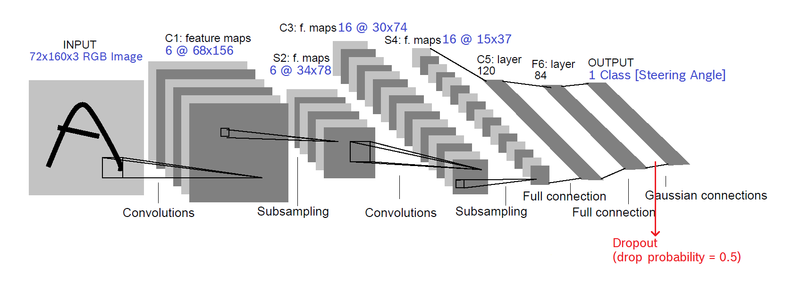

The **Image Pre-Processing Pipeline** is implemented **Within the Model in Lambda Layers**, so that it can be Parallelized on GPU and can be done On-the-fly so as to have a Better Performance:
1. Input - Camera Image from UDACITY Car Driving Simulator: 160x320x3 RGB Image [BGR Format].
2. Normalization and Zero Mean in a Lambda Layer: For an RGB Image: `X = (X/255.0 - 0.5)`.
3. Cropping for ROI (Region Of Interest) using Keras Function `Cropping2D()`. Here I Cropped `64 Pixels at the Top` and `24 Pixels at the Bottom` in order to Remove the Pixels related to the Scenery at the Top and the Car's Front Hood at the Bottom, so as to focus on the ROI - Road. Input: 160x320x3 RGB, Output: 72x320x3 RGB.
4. Scaling Down in a Lambda Layer using TensorFlow (Keras Backend used) Function `keras_tf.image.resize_images()`. Here I Re-Sized the Images To 72x160x3 RGB - basically Halved the Width as it was a bit too much.

#### 3.1.1.2 The following Table shows the **Model's Layer-wise Details**:

| **Layer**              | **Details**                                            | **Input**              | **Output**     |
|:----------------------:|:------------------------------------------------------:|:----------------------:|:--------------:|
| **Input**              | Pre-Processed Image - Normed, 0 Mean, Cropped & Scaled | **72x160x3 RGB Image** |                |
|                        |                                                        |                        |                |
|                        |                                                        |                        |                |
| **Layer 1:**           |                                                        |                        |                |
| **Convolution 1: 5x5** | 6 Feature Maps @ 68x156, strides=1x1, padding='VALID'  | 72x160x3               | 68x156x6       |
| Activation             | ReLU, to introduce Non-Linearity                       |                        |                |
| **Pooling**            | Max Pooling, strides=2x2                               | 68x156x6               | 34x78x6        |
|                        |                                                        |                        |                |
|                        |                                                        |                        |                |
| **Layer 2:**           |                                                        |                        |                |
| **Convolution 2: 5x5** | 16 Feature Maps @ 30x74, strides=1x1, padding='VALID'  | 34x78x6                | 30x74x16       |
| Activation             | ReLU, to introduce Non-Linearity                       |                        |                |
| **Pooling**            | Max Pooling, strides=2x2                               | 30x74x16               | 15x37x16       |
|                        |                                                        |                        |                |
|                        |                                                        |                        |                |
| **Flatten**            | Flatten Before Full Connection Operations              | 15x37x16               | 8880           |
|                        |                                                        |                        |                |
| **Layer 3:**           |                                                        |                        |                |
| **Full Connection**    |                                                        | 8880                   | 120            |
| Activation             | ReLU, to introduce Non-Linearity                       |                        |                |
|                        |                                                        |                        |                |
| **Layer 4:**           |                                                        |                        |                |
| **Full Connection**    |                                                        | 120                    | 84             |
| Activation             | ReLU, to introduce Non-Linearity                       |                        |                |
| **Dropout**            | Dropout, to Avoid Over-Fitting, Drop Probability = 0.5 |                        |                |
|                        |                                                        |                        |                |
|                        |                                                        |                        |                |
| **Layer 5:**           |                                                        |                        |                |
| **Full Connection**    | Final Output: **Logit**                                | 84                     | **1 Class**    |
|                        |                                                        |                        |                |
|                        |                                                        |                        |                |
| **Final Output:**      |                                                        |                        |                |
| **No Activation**      | Single Continuous Numeric Value for **Steering Angle** |                        |                |
|                        |                                                        |                        |                |


### 3.1.2 MODEL-2: Behavior Clone Model based on **NVIDIA End-To-End Learning CNN for Self-Driving Cars** [`model_beh-clone.py` Lines: 308-403]:
I based my 2nd Model on **NVIDIA End-To-End Learning CNN Architecture** as it is a proven CNN Model that works fairly well for Images, especially for **Self-Driving Cars**, which is our Primary Goal in this Project!  
I observed that the **Model Performed fairly Well in the First-go itself** with good **Accuracy on Test Set - Autonomous Drive Mode** even **WithOUT any Regularization** and so I decided to **NOT add a Dropout Layer**!

For this very reason, I decided to **Set this Model as the Default Choice** in my Model Selection Switch in the Code! [`model_beh-clone.py` Line: 190]:
```py
SWITCH_MODEL_CHOICE = NVIDIA_E2E_LEARN
```

#### 3.1.2.1 Here is the **Visualization** of **My Behavior Clone Model based on the Architecture of NVIDIA End-To-End Learning CNN for Self-Driving Cars:**
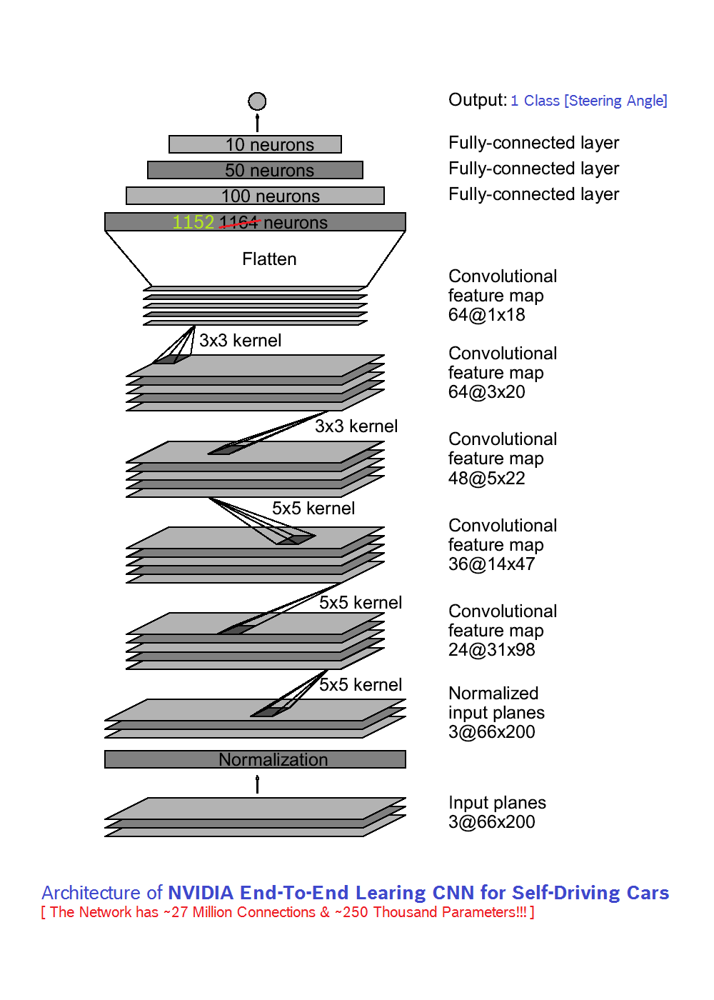

Here too, the **Image Pre-Processing Pipeline** is implemented **Within the Model in Lambda Layers**, so that it can be Parallelized on GPU and can be done On-the-fly so as to have a Better Performance:
1. Input - Camera Image from UDACITY Car Driving Simulator: 160x320x3 RGB Image [BGR Format].
2. Normalization and Zero Mean in a Lambda Layer: For an RGB Image: `X = (X/255.0 - 0.5)`.
3. Cropping for ROI (Region Of Interest) using Keras Function `Cropping2D()`. Here I Cropped `64 Pixels at the Top` and `24 Pixels at the Bottom` in order to Remove the Pixels related to the Scenery at the Top and the Car's Front Hood at the Bottom, so as to focus on the ROI - Road. Input: 160x320x3 RGB, Output: 72x320x3 RGB.
4. Scaling Down in a Lambda Layer using TensorFlow (Keras Backend used) Function `keras_tf.image.resize_images()`. Here I Re-Sized the Images To 66x200x3 RGB as per the NVIDIA Camera Format.

#### 3.1.2.2 The following Table shows the **Model's Layer-wise Details**:

| **Layer**              | **Details**                                            | **Input**              | **Output**     |
|:----------------------:|:------------------------------------------------------:|:----------------------:|:--------------:|
| **Input**              | Pre-Processed Image - Normed, 0 Mean, Cropped & Scaled | **66x200x3 RGB Image** |                |
|                        |                                                        |                        |                |
|                        |                                                        |                        |                |
| **Layer 1:**           |                                                        |                        |                |
| **Convolution 1: 5x5** | 24 Feature Maps @ 31x98, strides=2x2, padding='VALID'  | 66x200x3               | 31x98x24       |
| Activation             | ReLU, to introduce Non-Linearity                       |                        |                |
|                        |                                                        |                        |                |
| **Layer 2:**           |                                                        |                        |                |
| **Convolution 2: 5x5** | 36 Feature Maps @ 14x47, strides=2x2, padding='VALID'  | 31x98x24               | 14x47x36       |
| Activation             | ReLU, to introduce Non-Linearity                       |                        |                |
|                        |                                                        |                        |                |
| **Layer 3:**           |                                                        |                        |                |
| **Convolution 3: 5x5** | 48 Feature Maps @ 5x22, strides=2x2, padding='VALID'   | 14x47x36               | 5x22x48        |
| Activation             | ReLU, to introduce Non-Linearity                       |                        |                |
|                        |                                                        |                        |                |
| **Layer 4:**           |                                                        |                        |                |
| **Convolution 4: 3x3** | 64 Feature Maps @ 3x20, strides=1x1, padding='VALID'   | 5x22x48                | 3x20x64        |
| Activation             | ReLU, to introduce Non-Linearity                       |                        |                |
|                        |                                                        |                        |                |
| **Layer 5:**           |                                                        |                        |                |
| **Convolution 5: 3x3** | 64 Feature Maps @ 1x18, strides=1x1, padding='VALID'   | 3x20x64                | 1x18x64        |
| Activation             | ReLU, to introduce Non-Linearity                       |                        |                |
|                        |                                                        |                        |                |
| **Flatten**            | Flatten Before Full Connection Operations              | 1x18x64                | 1152           |
|                        |                                                        |                        |                |
| **Layer 6:**           |                                                        |                        |                |
| **Full Connection**    |                                                        | 1152                   | 100            |
| Activation             | ReLU, to introduce Non-Linearity                       |                        |                |
|                        |                                                        |                        |                |
| **Layer 7:**           |                                                        |                        |                |
| **Full Connection**    |                                                        | 100                    | 50             |
| Activation             | ReLU, to introduce Non-Linearity                       |                        |                |
|                        |                                                        |                        |                |
| **Layer 8:**           |                                                        |                        |                |
| **Full Connection**    |                                                        | 50                     | 10             |
| Activation             | ReLU, to introduce Non-Linearity                       |                        |                |
|                        |                                                        |                        |                |
| **Layer 9:**           |                                                        |                        |                |
| **Full Connection**    | Final Output: **Logit**                                | 10                     | **1 Class**    |
|                        |                                                        |                        |                |
|                        |                                                        |                        |                |
| **Final Output:**      |                                                        |                        |                |
| **No Activation**      | Single Continuous Numeric Value for **Steering Angle** |                        |                |
|                        |                                                        |                        |                |


### 3.2 Attempt Made to Reduce Over-Fitting of the Model
- RUBRIC: Train/Validation/Test Splits have been Used, and the Model uses Dropout Layers or Other Methods to Reduce Overfitting.

In order to Reduce Over-Fitting, a **Split of the Dataset --> 80% for Training and 20% for Validation** was used, as can be seen in [`model_beh-clone.py` Lines: 44-46], so that the **Model is Trained and Validated on Different Datasets**:
```py
### Split Dataset for Model Train & Validation
from sklearn.model_selection import train_test_split
drive_log_lines_train, drive_log_lines_validation = train_test_split(drive_log_lines, test_size=0.2)
```

In my **Behavior Clone Model based on LeNet-5**, to further Reduce Over-Fitting and Improve Model Performance & Accuracy, I added a **Dropout [drop probability = 0.5] just Before the Output Layer** [`model_beh-clone.py` Line: 261], which I observed to incrementally Improve the Model's **Accuracy on Test Set - Autonomous Drive Mode**.

However, in my **Behavior Clone Model based on NVIDIA End-To-End Learning CNN for Self-Driving Cars**, I observed that the **Model Performed fairly Well in the First-go itself** with good **Accuracy on Test Set - Autonomous Drive Mode** even **WithOUT any Regularization** and so I decided to **NOT add a Dropout Layer**!

Finally, the Models were successfully **Tested with a Different Test Set** - i.e, the Camera Images from UDACITY Car Driving Simulator during the Autonomous Drive Mode of the Car, and the **Car could Always Stay on the Track** very well.

### 3.3 Appropriate Tuning of Model Parameters
- RUBRIC: Learning Rate Parameters are chosen with explanation, or an Adam Optimizer is used.

#### 3.3.1 The **Models' Parameters** can be seen in [`model_beh-clone.py` Lines: 192-196]:
1. I used `batch_size = 120`, in order to **Train & Validate the Models with Smaller Sub-Sets of Data** in order to have a Better Performance during Training & Validation. Also, I chose `120` because I was generating `6` Images [3 Regular Images in Total from Center, Left & Right Cameras, and the Augmented [Flipped on Vertical Axis] Images of Each of them] from Each Log Line in the UDACITY provided CSV Log File [Please see Next Section for Details] and `120` is a Number Divisible by `6`.
2. I used `epochs = 3` as it was **Good enough for the Large Dataset of Training/Validation Images** that I collected [Please see Next Section for Details], and `>3` was NOT yielding either a significant Reduction in Validation Loss [In fact, the Validation Loss was Slightly Increasing With EPOCHS as can be seen in the **MSE Loss Plot** given below for my **Behavior Clone Model based on LeNet-5**] or a noticeable Improvement in the Car Driving in Autonomous Mode.
3. I used `dropout_drop_prob = 0.5` for the **Dropout Layer** in my **Behavior Clone Model based on LeNet-5**. This was the first Value that I tried and I straight away saw Improvement in the Car Driving in Autonomous Mode. It Improved the Autonomous Driving of the Car from a Situation where the Car was Going Out of the Track Within ~2 Laps to a more Robust Situation where the Car Stays Within Track for the ~5-6 Laps that I Tested.

#### 3.3.2 Model **Learning Rate**
As I used **ADAM Optimizer** for the Training of the Models [`model_beh-clone.py` Lines: 268, 365], Manual Tuning of Learning Rate was Not Required.

#### 3.3.3 **Additional Parameter - Steering Angle Offset** for Left & Right Camera Perspectives with reference to Center Camera's Measurement
I used `steer_angle_diff_offset = 0.3` [`model_beh-clone.py` Line: 128] in order to Artificially Synthesize the Corresponding Steering Angle Measurements with respect to the Left & Right Camera Perspectives, by Adding this as an Offset to the Center Camera's Steering Angle Measurement. I tried Values in the Range of `0.2 to 0.4` and I found `0.3` to be Optimum in the Autonomous Mode Car Drive.

#### 3.3.4 **MSE Loss Plot** for my **Behavior Clone Model based on LeNet-5**
I used **MSE (Mean Squared Error)** as the **Loss Function** for the Training of my Models, as MSE works Well as in the Case of my Behavior Cloning Models wherein the **Output of the Model is a Single Continuous Numeric Value [Steering Angle]**.

I could see that the **Validation Loss** was Slightly **Increasing With EPOCHS** in Contrary to the **Training Loss Decreasing With EPOCHS**. As this is an indication of **Over-Fitting**, I stopped with `epochs = 3`.

**MSE Loss Plot** for my **Behavior Clone Model based on LeNet-5**:

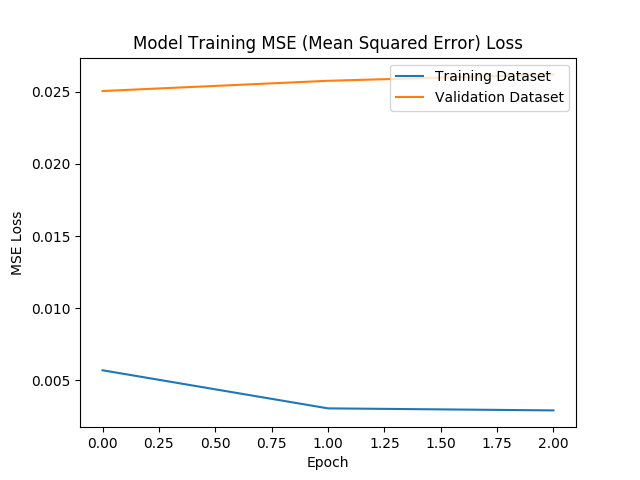

### 3.4 Training Data Collection - Appropriate Choice of Training Data
- RUBRIC: Training Data has been chosen to induce the Desired Driving Behavior in the Simulation - i.e., Keeping the Car on the Track.

The **Goal** is to use the UDACITY Car Driving Simulator and **Collect Data of Good Driving Behavior**, so as to **Keep the Car on the Track** while later Driving the **Car in Autonomous Mode using the Trained Behavior Cloning Model**.

#### 3.4.1 UDACITY provided Sample Training Dataset
To start with, I used the [**UDACITY provided Sample Training Dataset**](https://d17h27t6h515a5.cloudfront.net/topher/2016/December/584f6edd_data/data.zip) for my Model Training.  
It contains **Images of the Road from 3 Cameras** [Center, Left, Right] mounted on the Car, and also the **Corresponding Measurements of the Car Parameters**, neatly indexed and organized in a **CSV File** as **Log Lines**. **Each Log Line** points to an **Instance of the 3 Camera Images** and the Corresponding Values of **Steering Angle with respect to Center Camera, Throttle, Brake and Speed of the Car**.  
By Exploring the Images, I could observe that it contained **Sample Data with a Good Combination of the following Use-Cases**:
1. **Center Lane Driving** - Ideal Driving Use-Case  
   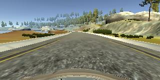  
   
2. **Recovery Driving** - Driving From Left & Right Edges of the Track To Center, so as to Recover if the Car Drifts to the Edges  
   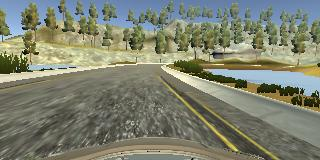  
   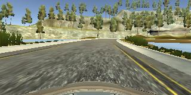  
   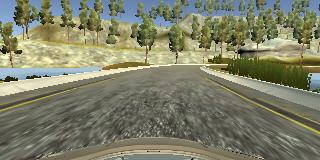  
   
3. **Reverse Track Direction Driving** - For Training Data Generalization by **Avoiding Turn Bias** towards a Particular Side  
   Example showing Reverse Track Driving near the 1st Left Turn After Start in the Forward Direction:  
   **Forward Track Direction:**  
   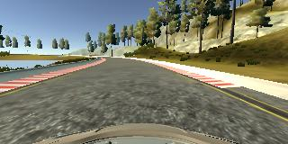  
   
   **Reverse Track Direction:**  
   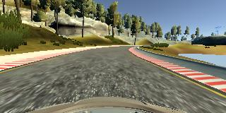

#### 3.4.2 My Additional Training Dataset For Corner Cases
When I used the corresponding Trained Model for the Autonomous Driving of Car in the UDACITY Car Driving Simulator, I observed that though the Training Data was fairly Good, i.e., the Car could Run Within the Track for the most part, it had **Problems** and could still NOT Stay Within the Track in the following **Corner Cases**. So I went ahead and Collected Training Data for the same as below:
1. [**Acute Left Turn** (Click Link to Download Dataset)](./MoreTrainData/1_AcuteLeftTurn.zip)  
     
   
2. [**No Guard On Right Side** (Click Link to Download Dataset)](./MoreTrainData/2_NoGuardOnRight.zip)  
   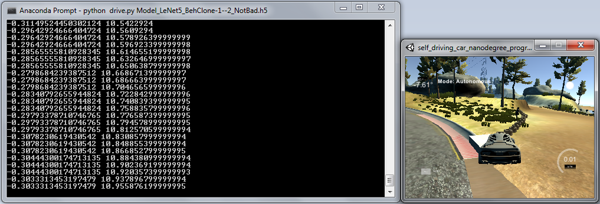  
   
3. [**Right Turn, No Guard On Left Side** (Click Link to Download Dataset)](./MoreTrainData/3_RightTurnNoGuardOnLeft.zip)  
   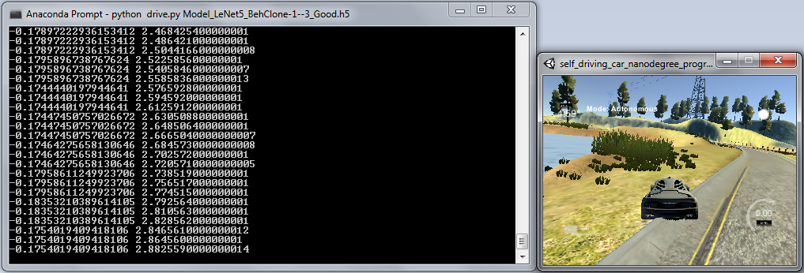

For Details about my Approach on How I created the Actual Training Data from these Images & Steering Measurements, please see the Next Section.


## 4. Model Architecture and Training Approach Documentation:
### 4.1 Solution Design Approach
- RUBRIC: The README (Project Writeup) thoroughly discusses the Approach taken for Deriving and Designing a Model Architecture fit for Solving the given Problem.

The **Overall Strategy** for deriving a Model Architecture was to **Base My Behavior Cloning Model** on a **Proven Deep Learning Architecture** which is good for **Processing Images and give a Robust Prediction Output**. The Reason being, in this Driving Behavior Cloning Project the Primary Goal for the Model is to *'See'* the Images of the Road coming from Cameras mounted on the Car looking onto the Road and Output a Steering Angle Prediction.

#### 4.1.1 **Model-1: My Behavior Cloning Model Based On LeNet-5 CNN Architecture**
As a First Step, I started-off with a **Model based on LeNet-5 Architecture** as it is a proven CNN Architecture for **Processing Images and Predicting a Robust Output**, and so I thought it is Appropriate for this Project. Another Reason being, I have previous Experience with this Model as part of my Previous Projects.

For this Project, we use the Camera Images and only the Steering Angle Value for Training & Validation of the Model.

In order to Effectively Train the Model, and to gauge How Well the Model is working, I split my Sample Dataset of Camera Images and Steering Angle Values into a **Training Set [80% of All Data] & a Validation Set [20% Remaining Data]**.

In my **Initial Explorations**, I saw that *in spite of* my **Training Loss & Validation MSE (Mean Squared Error) Loss both being very Small Numbers**, the **Performance of the Model** was **Poor** in the Autonomous Driving Mode. I understood this is because of the **Lack of Appropriate Data in my Dataset** to cover **All Use-Cases, particularly the Corner Cases**. So I added More Data and More Processing to the Data as I have explained in the **Section 4.3 Creation of the Training Dataset and Training Process** below.

After this, I saw that though the **Training Loss was Less**, the **Validation Loss was Increasing More** with Each EPOCH. As this is an indication of the **Model Over-Fitting**, in order to Reduce it, I added a **Dropout Layer** Just Before the Output Layer. Now things improved, and I could see that the **Validation Loss is OK** - It was only Slightly Increasing with Each EPOCH (as can be seen in the **MSE Loss Plot** given above). For the same Reason, I decided to stop with **3 EPOCHS for Training & Validation**.

I then proceeded with the Test of the Model for the **Autonomous Driving of the Car**, and I could see that the **Car could Always Stay within the Track** for the Entire Laps! :-)

However, as the Car was Swaying a lot, even after my Repeated Attempts with Training & Tuning the Parameters including the Steering Offset Values, I was not fully satisfied and so I decided to explore Another Model!

#### 4.1.2 **Model-2: My Behavior Cloning Model Based On NVIDIA End-To-End Learning CNN for Self-Driving Cars**
As a Second Step, I wanted to try a **Model based on NVIDIA End-To-End Learning CNN Architecture for Self-Driving Cars** as it is a proven CNN Architecture for the **Use-Case of Self-Driving Cars** for **Processing Camera Images and Predicting Robust Vehicle Control Outputs**, and so I thought it is Appropriate for this Project. Another Reason being, I wanted to try out and experience a New Model! :-)

I kept the **Same Datasets and Pre-Processing Pipelines** as above and went ahead with **Training & Validation of just 1 EPOCH** as an initial try, and now I could see that the **New Model's Performance was wonderfully Well!** Both the **Training & Validation Losses were very Less**. Also in the Test of the Model for the **Autonomous Driving of the Car**, I could see that the **Car could Always Stay within the Track** for the Entire Laps and also the **Drives were Smoother** compared to that of my Model-1! :-)

I understand this could be because of the **More Convolution Layers** and thus **More Parameters** used by the **NVIDIA Model** which helps in **Better & More Precise Outputs**.

### 4.2 Final Model Architecture
- RUBRIC: The README (Project Writeup) provides sufficient Details of the Characteristics and Qualities of the Architecture, such as the Type of Model used, the Number of Layers, the Size of Each Layer. Visualizations emphasizing particular Qualities of the Architecture are encouraged.

At the end, I had **2 Models based on 2 different Architectures**, and **Both Performing Well** in the Autonomous Driving of the Car and Meeting the Project Specifications - the **Car could Always Run Autonomously Within the Track**.

However, as the **NVIDIA End-To-End Learning Model** was **Driving the Car Smoother**, I kept that as the *Default Choice* in the Feature Switch in my Code.

The Final **Model Architectures** and **Model Visualizations** are shown in **Section 3.1 Appropriate Model Architecture for the Task** above.

### 4.3 Creation of the Training Dataset and Training Process
- RUBRIC: The README (Project Writeup) describes How the Model was Trained and What the Characteristics of the Dataset are. Information such as How the Dataset was Generated and Examples of Images from the Dataset must be included.

#### 4.3.1 Steps Followed to Create a Good Training/Validation Dataset
I did the following **Steps** in order to **Create a Good Training Dataset** so as to Capture & Teach a Good Driving Behavior to my **Deep Learning Behavior Cloning Model**:
1. I Started-Off with the **UDACITY provided Sample Training Dataset**.  
   I used a **80-20 Split for Training & Validation** and also **Randomly Shuffled** the Data for Each Training/Validation EPOCH. The Validation Dataset helped in determining whether the Model is Over-Fitting during Training, as it can be easily deduced from the Training Loss vs. Validation Loss (as I explained above in **Section 4.1 Solution Design Approach**).  
   I first used only the Center Camera Images.  
   After my Initial Explorations of the Model Training Accuracies and Autonomous Driving of the Car, even though the UDACITY Dataset contained a **Fair Coverage of Different Use-Cases** as I explained in **Section 3.4 Training Data Collection - Appropriate Choice of Training Data** above, I felt the need to Collect **More Data to Fully Cover All Different Use-Cases**.
2. In addition to the **Center Camera Images**, I added the **Left & Right Camera Images** too [So now 3 Images taken for Each Log Line] with Corresponding **Artificially Synthesized Steering Angle Values** (as I have explained earlier above) to the Training & Validation Datasets.  
   The Side Camera Images have a Shifted Perspective as though the Car is Closer to the Track Edges, and so we Synthesize the Corresponding Steering Angle Values with a Corresponding Offset from the Measured Value [Positive Offset for Left Camera Image, Negative Offset for Right Camera Image]. The idea is, During Autonomous Drive when the Model is fed only with Center Camera Images, if in case it sees an Incoming Image similar to the ones from the Side Cameras, it knows that the Car is Drifting to the Edge and so it Outputs a Harder Steering Angle Value [Original Value with Offset].  
   Thus, this way I expected the Model to Generalize well in terms of knowing How To **Recover** well if the Car Drifts to the Edges of the Track.
3. Then I Added **Augmented Images** of the above Set - i.e., Added **Images Flipped along the Vertical Axis**, with their Corresponding **Negated Steering Measurements** - to the Training & Validation Datasets [So now I have 3 + 3 = 6 Images for Each Log Line].  
   This way I expected the Model to **Balance any Turn Bias** it has Learned for Turns towards a Particular Side based on the Training Images [For instance, Track-1 has more Left Turns and so the Model could easily Bias its Learning for Left Turns and might Perform Poorly for Right Turns!].  
   Also, the Images from UDACITY's Sample Training Dataset for **Reverse Track Driving** Use-Case should help to **Balance any Turn Bias**.  
   At the End of these Steps, I had in **Total 8036 Log Lines x 6 = 48216 Data Points** [Images + Steering Angle Measurements].
4. I also did **Pre-Processing of the Images** in my **Pre-Processing Pipeline - Lambda Layers** kept within the Model so as to enable Parallelization of Pre-Processing in GPUs and thus offer Better Performance for **Model Training & Validation**.  
   Also, this ensured that I apply the **Same Pre-Processing Pipeline** even for the **Prediction Use-Case** - Images From `drive.py` for **Autonomous Drive Mode**:  
   1. Normalize & Zero-Mean the Data.
   2. Appropriate Cropping of the Images to Focus only on the Region of Interest [ROI], i.e., the Road.
   3. Appropriate Scaling-Down of the Images in order to have a Better Performance for Model Training & Validation.
5. Finally I Collected and added **More Data to cover More Corner Use-Cases** as I explained in **Section 3.4 Training Data Collection - Appropriate Choice of Training Data** above.  
   I had in **Total Collected 2607 Log Lines of Corner Cases**, and So I had **2607 x 6 = 15642 Data Points**.  
   So as a **Grand Total, Overall my Dataset consisted of 48216 + 15642 = 63858 Data Points**.  
   Due to the **80-20 Split** of Training and Validation Data, I Finally Had:  
   1. **Training Data = 51086 Data Points**.
   2. **Validation Data = 12772 Data Points**.

#### 4.3.2 Dataset Examples Visualization
Below are some **Examples of the Different Types of Data**:

#### Images From 3 Cameras - Example
**Left Camera**, **Center Camera**, **Right Camera**:

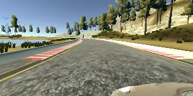 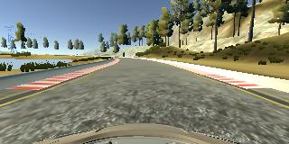 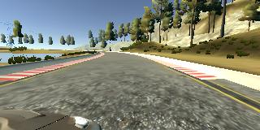

#### Flipped Images - Example
**Left Camera**, **Center Camera**, **Right Camera**:

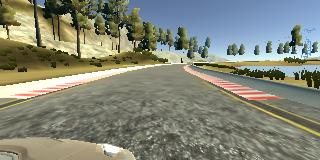 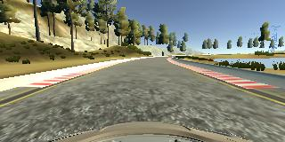 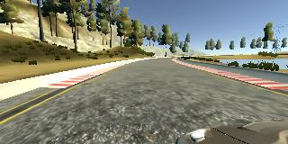

Thus, after a lot of Trials, with adding Different Types of Data, **I could achieve the Required Training/Validation Datasets** which helped me in **Achieving the Specified Output** --> **Successful Autonomous Drive of the Car** for Whole Laps in UDACITY Car Driving Simulator!

#### 4.3.3 Training Process
I followed the **Training Process** and **Finalized different Parameters** as I have explained above in **Section 4.1 Solution Design Approach** and **Section 3.3 Appropriate Tuning of Model Parameters**.


## 5. Simulation:
### 5.1 Correctness of Car's Navigation on Test Data
- RUBRIC: No Tire may Leave the Drivable Portion of the Track Surface. The Car may Not Pop-up Onto Ledges or Roll-Over any Surfaces that would otherwise be considered Unsafe (if Humans were in the Vehicle). The Simulator contains Two Tracks. To meet Specifications, the Car must Successfully Drive around Track One.

Finally, **I could make the Autonomous Driving of the Car in UDACITY Car Driving Simulator Track-1 with Complete Success!!!** - The Car was ALWAYS Staying Within the Track for the **~5-6 Laps that I Tested!**. No Tire Leaving the Drivable Portion of the Track, No Popping-up or Roll-Over of the Car Onto the Ledges or any Other Unsafe Surfaces for the Entire Laps! **Hurray!!! :-)**

I Tested **Successful Autonomous Driving of the Car using Both of my Behavior Cloning Models**. I observed that **My Model Based On NVIDIA End-To-End Learning CNN for Self-Driving Cars** was driving much **Smoother** when compared to **My Model based on LeNet-5 CNN** (as can be seen in the Videos below). I understand this could be because of the **More Convolution Layers** and thus **More Parameters** used by the **NVIDIA End-to-End Learning Model** which helps in **Better & More Precise Outputs**.

#### FINAL OUTPUT - 1: **Successful Autonomous Driving of Car** in UDACITY Car Simulator Track-1 using **My Model Based On NVIDIA End-To-End Learning CNN for Self-Driving Cars**
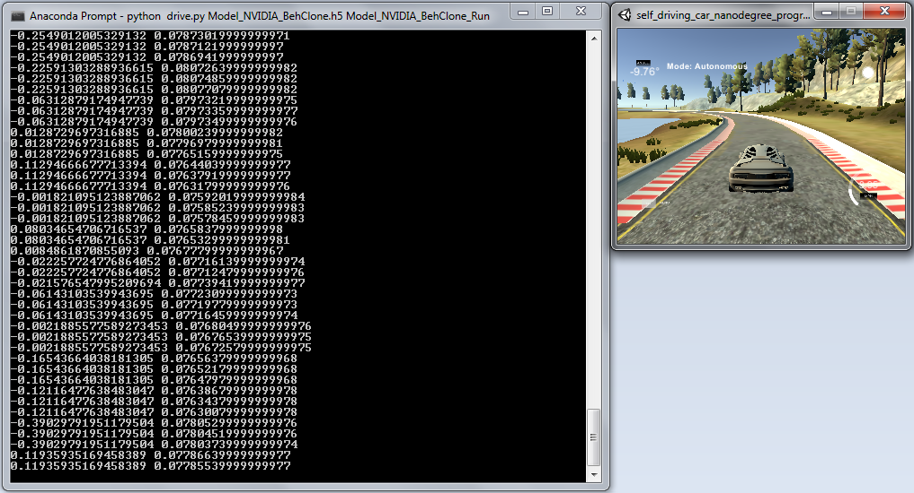

**Click Here for the Video:**

[Autonomous Driving of Car using My Behavior Cloning Model based on NVIDIA E2E Learn](./Videos/Model_NVIDIA_BehClone_Run-30FPS.mp4)

#### FINAL OUTPUT - 2: **Successful Autonomous Driving of Car** in UDACITY Car Simulator Track-1 using **My Model based on LeNet-5 CNN**
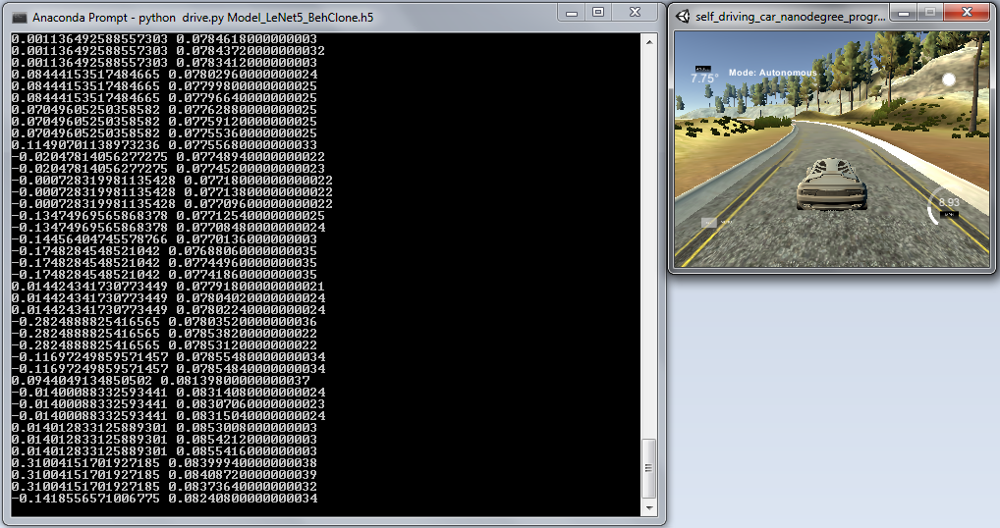

**Click Here for the Video:**

[Autonomous Driving of Car using My Behavior Cloning Model based on LeNet-5](./Videos/Model_LeNet5_BehClone_Run-30FPS.mp4)


## 6. Optional Extra Step - More Difficult Track-2:
- RUBRIC: The Simulator contains Two Tracks. To Meet Specifications, the Car must Successfully Drive around Track One. Track Two is more Difficult! See if you can get the Car to Stay on the Road for Track Two as well.

Though I collected Training Data from Track-2, I could Not explore Training & Autonomous Driving in Track-2 due to time constraints! Also, from my Exploratory Observation of the Difficulty of Track-2 [Mountain Road, Very Sharp Turns and U-Turns, all going Suddenly Up and Suddenly Down], I'm convinced that in order to have a Good Autonomous Driving in Track-2, Automatic Control of Steering Angle Alone will NOT be Enough and Controlling Acceleration & Brake would also be Needed!

*So, I will come back here Later!* :-)

---
---
---
